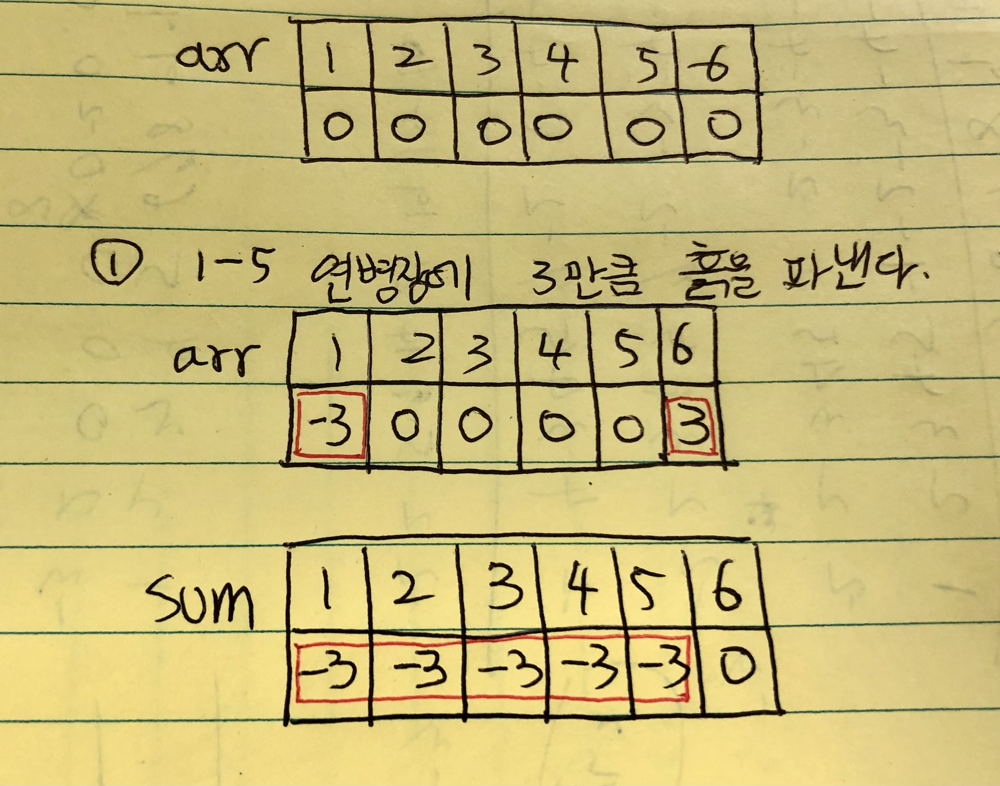

### 문제

- [태상이의 훈련소 생활](https://www.acmicpc.net/problem/19951)

### 접근 방법
연병장의 크기(N)과 조교의 수(M)가 각각 최대 10만 이므로 모든 조교의 지시에 해당하는 모든 연병장의 높이를 변경하기 위해서는 O(N*M)의 시간 복잡도가 요구되고, 해당 방법으로 진행하면 시간 초과가 발생할 것이다. 따라서 연병장 크기 변경을 선형으로 한 번에 처리해야 한다. 누적 합을 이용하면 문제를 해결할 수 있다.

1. 변경될 연병장의 흙 높이를 저장한다. 만약 1-5의 연병장에 있는 흙을 3만큼 파낸다고 할 때, 1번(i) 배열에 -3을 더하고, 6번(i+1) 배열에 -3을 빼서 값을 저장하는 것이다. 즉, 1-5번 연방장의 흙을 모두 연산하여 계산하는 것이 아니라 i번과 i+1번 인덱스만을 사용하여 변화될 연병장의 흙 높이를 표시하는 것이다. 그리고 누적 합을 구하면 최종적으로 각 연병장에 추가될 흙의 높이를 구할 수 있다. 아래의 이미지를 보면 쉽게 이해할 수 있다.




2. 초기 연병장 높이에 추가될 흙의 높이를 더하면 최종적으로 각 연병장의 높이를 구할 수 있다.


### 소스 코드

```java
import java.io.BufferedReader;
import java.io.IOException;
import java.io.InputStreamReader;
import java.util.StringTokenizer;

public class Main {

	public static void main(String[] args) throws IOException {
		BufferedReader br = new BufferedReader(new InputStreamReader(System.in));
		StringTokenizer st = new StringTokenizer(br.readLine());
		int N = stoi(st.nextToken());
		int M = stoi(st.nextToken());
		int[] height = new int[N + 1];
		st = new StringTokenizer(br.readLine());
		for (int i = 1; i <= N; i++) {
			height[i] = stoi(st.nextToken());
		}
		int[] changeHeight = new int[N + 1];
		for (int i = 0; i < M; i++) {
			st = new StringTokenizer(br.readLine());
			int start = stoi(st.nextToken());
			int end = stoi(st.nextToken());
			int k = stoi(st.nextToken());
			changeHeight[start] += k;
			if (end + 1 <= N) {
				changeHeight[end + 1] -= k;
			}
		}
		for (int i = 1; i <= N; i++) {
			changeHeight[i] += changeHeight[i - 1];
			height[i] += changeHeight[i];
		}
		StringBuilder answer = new StringBuilder();
		for (int i = 1; i <= N; i++) {
			answer.append(height[i]);
			if (i < N) {
				answer.append(" ");
			}
		}
		System.out.print(answer);
	}

	private static int stoi(String input) {
		return Integer.parseInt(input);
	}
}

```

### 참고
- https://anz1217.tistory.com/136