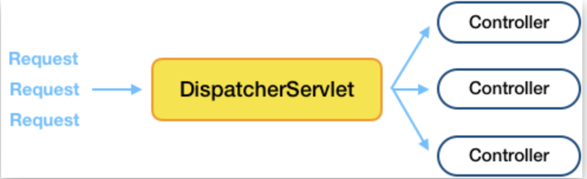

## 1. Servlet은 어떻게 등장하게 되었을까?

일반적으로 웹 서버는 정적인 페이지만을 제공한다. 그렇기 때문에 상품 검색, 댓글 작성과 같은 사용자의 요청을 완료한 동적인 페이지를 제공하기 위해서는 동적인 처리를 담당할 무언가가 필요했고, 이러한 역할을 담당하는 `CGI`가 등장하게 되었다.

### CGI(Common Gateway Interface)

CGI는 **웹 서버와 응용 프로그램간에 데이터를 주고받기 위한 방법이나 규약**을 뜻한다. CGI 방식은 어떠한 프로그래밍 언어로도 구현이 가능하다.

1. 웹 브라우저의 HTML 폼을 통해 요청이 웹 서버로 전달
2. 웹 서버는 요청에 들어있는 주소가 CGI 프로그램에 대응되는지 확인
3. 대응될 경우, 프로그램을 실행하고 환경 변수와 표준 입력의 형태로 요청을 전달한다.
4. 웹 서버는 CGI 프로그램이 표준 출력으로 돌려보낸 내용을 그대로 응답으로 돌려준다.

### CGI 단점

CGI는 `멀티 프로세스` 방식을 사용하기 때문에 요청이 들어 올 때마다 프로세스를 새로 생성하고, 따라서 상당히 많은 자원을 차지하게 된다.

이를 해결하기 위해서 프로세스가 아닌 `스레드`를 생성하는 `Servlet` 이 등장했다.

## 2. Servlet

Servlet은 **클라이언트의 요청을 처리하고, 그 결과를 반환하는 Servlet 클래스의 구현 규칙을 지킨 자바 웹 프로그래밍 기술** 을 말한다. 간단히 말해서, 웹 서버 프로그래밍을 위해 만들어진 자바 프로그램 혹은 코드라고 할 수 있다.

위에서 CGI의 멀티 프로세스 방식을 멀티 스레드 방식으로 확장한 것이 Servlet 이라고 했다. 따라서 CGI가 요청을 받아 처리한 결과를 동적으로 응답해주는 역할을 하는 것처럼 Servlet도 동일한 역할을 수행한다.

Servlet도 인터페이스이므로 구현체가 존재한다. `Spring MVC`는 웹 애플리케이션을 만드는데 특화된 서블릿 구현체이다. Spring MVC 에서는 `Dispatcher Servlet` 이라는 모든 요청을 담당하는 서블릿을 두고 컨트롤러에 위임하여 요청을 처리한다.

### Servlet 특징

- HTML을 사용하여 요청에 응답한다.
- Java Thread를 이용하여 동작한다.
- MVC 패턴에서 Controller로 이용된다.
- HTTP 프로토콜 서비스를 지원하는 javax.servlet.http.HttpServlet 클래스를 상속받는다.
- HTML 변경 시, Servlet을 재컴파일 해야한다.
- `Servlet Container` 에 의해 관리 및 실행된다.

### Servlet 동작 과정

## 3. Dispatcher Servlet
클라이언트가 요청을 보내면 Servlet Container가 요청을 받는다. 이때 제일 앞에서 서버로 들어오는 모든 요청을 처리하는 Front Controller 라는 것을 Spring에서 정의하였고, 이를 `Dispatcher Servlet` 이라고 한다.

이와같은 프론트 컨트롤러 디자인 패턴이 적용된 Spring MVC를 통해 개발자는 별도의 서블릿 개발 없이 Controller의 구현만으로 동적인 응답을 클라이언트에게 줄 수 있다.

### Dispatcher Servlet 동작 과정

- HandlerMapping
   - 클라이언트의 Reqeust를 분석하여 매핑된 Controller가 있는지 확인한다.
- HandlerAdapter
   - 매핑 대상 Controller에게 Request 처리 요청을 보낸다.
- ViewResolver
   - Controller에서 view를 return 했을 경우, 해당하는 view를 찾아 클라이언트에게 return 한다.

## 4. Servlet Container

**서블릿을 관리해주는 컨테이너** 이다. 서블릿 컨테이너는 클라이언트 요청을 받고 응답할 수 있도록 웹 서버와 소켓으로 통신하며 대표적으로 톰캣이 있다. 톰캣은 웹 서버와 통신하여 JSP와 Servlet이 작동하는 환경을 제공해준다. 

### Servlet Container 역할

1. 웹 서버와 통신 지원

   서블릿과 웹 서버가 쉽게 통신할 수 있도록 해준다. 일반적으로 소켓을 만들고 listen, accept 등의 일련의 통신 과정이 필요하지만, 서블릿 컨테이너는 이러한 기능을 API로 제공하여 복잡한 과정을 생략할 수 있게 해준다. 그래서 개밸자가 서블릿에 구현해야 하 비지니스 로직에만 초점을 둘 수 있도록 도와준다.

2. 서블릿 생명주기 관리

   서블릿 클래스를 로딩해서 인스턴스화하고, 초기화 메서드를 호출하고, 요청이 들어오면 적합한 스블릿 메소드를 찾아서 호출한다.

   서블릿의 생명이 끝나는 순간 가비지 컬렉션을 진행한다.

3. 멀티스레딩 지원 및 관리

   서블릿 컨테이너는 요청이 올 때마다  새로운 자바 스레드를 생성하여 작업을 수행한다. 여러 요청이 동시에 들어오면 멀티 스레드 환경으로 작업을 한다.

   

### Servlet 생명주기

1. 서블릿 로딩

   웹 서버가 시작되면 서블릿 컨테이너가 모든 서블릿을 배포하고 로드한다.

2. 서블릿 인스턴스 생성

   모든 서블릿 클래스가 로드되면 서블릿 컨테이너는 각 서블릿 클래스의 인스턴스를 생성한다. 서블릿 클래스당 한 번만 인스턴스를 생성하고 서블릿에 대한 모든 요청은 동일한 서블릿 인스턴스에서 실행된다.

3. init() 메서드 한 번 호출

   모든 서블릿 클래스가 인스턴스화 되면 인스턴스화된 각 서블릿에 대해 init() 메소드가 호출되고, 서블릿을 초기화한다.

4. 클라이언트 요청에 대하여 반복적으로 service() 메서드 호출

   웹 서버는 서블릿에 대한 요청을 수신할 때마다 service() 메소드를 호출하는 새 스레드를 생성한다. 서블릿이 GenericServlet이면 요청은 service() 메소드 자체에 의해 제공되고, 서블릿이 HttpServlet이면 service() 메소드는 요청을 수신하고 요청 유형에 따라 올바른 핸들러 메소드에 전달한다.

5. destory() 메서드 호출

   서블릿 컨테이너가 종료되면(일반적으로 웹 서버를 중지할 때 발생) 모든 서블릿을 언로드하고 destroy() 메소드를 호출한다.

## 5. 총정리
 위의 내용을 바탕으로 Web에서 클라이언트가 Request를 보내고 Response를 받는 과정을 정리해보자.

Tomcat을 실행하면 로그를 통해 서비스를 위해 어떤 순서로 프로젝트 세팅이 이루어지는지 확인할 수 있다.
 

### Server Start
1. Web Server init
2. Root WebApplicationContext 로딩
3. Web Server start
 
### Client 호출
1. Web Server 로 Request를 보냄
2. Servlet Container로 전달
3. Servlet Container 스레드 생성
4. DispatcherServlet init (서블릿 생성 안되어 있는 경우)
5. 생성된 스레드에서 DispatcherServlet service() 메서드 호출
6. HandlerMapping을 통해 매핑되는 컨트롤러 조회
7. HandlerAdapter를 통해 매핑되는 컨트롤러에 Request 전달
8. 개발자가 구현한 비지니스 로직(Controller -> Service -> Respository) 동작

## 참고

- [servelt은 어짜다 탄생되었을까](https://velog.io/@adam2/Servelt%EC%9D%80-%EC%96%B4%EC%A9%8C%EB%8B%A4-%ED%83%84%EC%83%9D%EB%90%98%EC%97%88%EC%9D%84%EA%B9%8C)
- [서블릿이란?](https://mangkyu.tistory.com/14)
- [서블릿 생명주기](https://beginnersbook.com/2013/05/servlet-life-cycle/)
- [Tomcat, Spring MVC의 동작 과정](https://taes-k.github.io/2020/02/16/servlet-container-spring-container/)