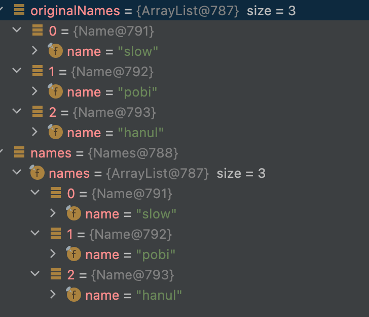
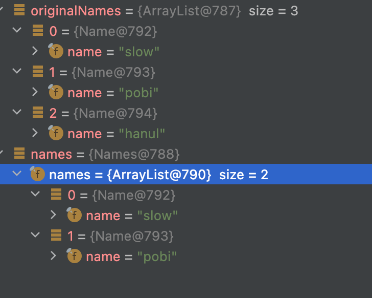
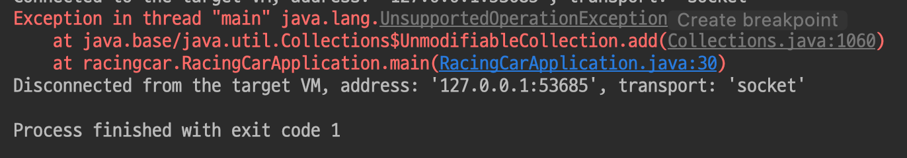

### 불변 객체(Immutable Object)란?
`한 번 객체가 생성되면, 그 상태를 바꿀 수 없는 객체`를 말한다.

### 원시 타입(primitive type)에서의 불변
원시 타입은 참조 값이 없기 때문에 값을 외부로 내보내는 경우에도 내부 객체는 불변이다. 따라서 내부 값을 바꿀 수 없도록 setter를 생성하지 않는 것만으로 원시 타입으로 이루어진 객체는 불변으로 만들 수 있다.

### 참조 타입(reference type)에서의 불변

```java
public class Names {

	private final List<Name> names;

	public Names(List<Name> names) {
		this.names = names;
	}
}

public class Name {

	private static final int MAX_NAME_LENGTH = 5;
	private final String name;

	public Name(String name) {
		this.name = name;
	}
}
```

`Names`에서 이름 List를 `final`로 선언하여 재생성을 막았고, `setter` 또한 존재하지 않는다. 

**그렇다면 Names는 불변 객체일까?**

```java
List<Name> originalNames = new ArrayList<>();
originalNames.add(new Name("slow"));
originalNames.add(new Name("pobi"));

Names names = new Names(originalNames);

originalNames.add(new Name("hanul"));
```



객체가 생성된 이후에도 외부의 값 변경에 따라 변하는 것을 볼 수 있다. 이유는 외부에서 입력한 originalNames의 `주소를 공유`하고 있기 때문이다. 이처럼 외부에서 Names가 가지고 있는 names 인스턴스의 요소를 변경할 수 있기 때문에 **불변 객체라고 할 수 없다.**

**어떻게 불변 객체로 만들 수 있을까?**

### 방어적 복사
생성자에서 인자를 전달 받을 때 `new ArrayList<>(names)` 를 통해 새로운 주소 값을 참조하도록 복사하면 된다. 이렇게 하면 외부에서 넘겨주는 List와 주소가 다르기 때문에 **외부에서 변경할 수 없다.**

```java
public class Names {

	private final List<Name> names;

	public Names(List<Name> names) {
		this.names = new ArrayList<>(names);
	}
}
```




**이제는 완벽한 불변 객체일까?**


```java
List<Name> originalNames = new ArrayList<>();
originalNames.add(new Name("slow"));
originalNames.add(new Name("pobi"));

Names names = new Names(originalNames);

names.getNames().add(new Name("hanul"));
```

위의 코드처럼 getter를 사용할 수 있다면 여전히 외부에서 값을 변경할 수 있다는 문제가 있다. 따라서 여전히 불변 객체가 아니다.

### Unmodifiable Collection
`Unmodifiable Collection`을 이용하면 외부에서 변경할 때 예외처리가 되기 때문에 안전하게 보장할 수 있다.
`unmodifiableList()` 메서드를 통해서 리턴되는 리스트는 `읽기 전용`으로 사용할 수 있고, add(), set() 등의 변경을 가하는 메서드를 호출하면 `UnsupportedOperationException`이 발생한다.

```java
public class RacingCarApplication {

	public static void main(String[] args) {
		List<Name> originalNames = new ArrayList<>();
		originalNames.add(new Name("slow"));
		originalNames.add(new Name("pobi"));

		Names names = new Names(originalNames);

		names.getNames().add(new Name("hanul"));
    }
}
```

```java
public List<Name> getNames() {
    return Collections.unmodifiableList(names);
}
```




### List.copyOf()
자바 10에 등장한 메소드이며 불변 객체를 만드는 또 하나의 방법이다. 

```java
static <E> List<E> copyOf(Collection<? extends E> coll) {
	return ImmutableCollections.listCopy(coll);
}
```

원본 리스트를 복사하고 unmodifiable List 를 반환한다. 즉, 위에서 불변 객체를 만들기 위해서 진행했던 방어적 복사와 unmodifiableList 반환을 합친 것이라고 생각하면 된다. 

- AS-IS (방어적 복사, unmodifiableList 사용)

```java
public class Names {

	private final List<Name> names;

	public Names(List<Name> names) {
		this.names = new ArrayList<>(names);
	}
}

public List<Name> getNames() {
    return Collections.unmodifiableList(names);
}
```

- TO-BE (List.copyOf 사용)

```java
public class Names {

	private final List<Name> names;

	public Names(List<Name> names) {
		this.names = List.copyOf(names);
	}
}

public List<Name> getNames() {
    return names;
}
```


그리고 List.copyOf()는 인자로 들어온 리스트가 null 이거나, 인자의 리스트에 null 값이 포함되어 있으면 `NullPointerException` 이 발생한다.

```java
@Test
void copyOf() {
	List<String> origin = Arrays.asList(
			"slow",
			null
	);

	assertThatThrownBy(() -> List.copyOf(origin))
			.isInstanceOf(NullPointerException.class);
	
	assertThatThrownBy(() -> List.copyOf(null))
			.isInstanceOf(NullPointerException.class);
}
```

### 요약
- 방어적 복사와 unmodifiable collection 을 이용하면 외부에서 내부의 값을 제어할 수 없다. 따라서 `객체 내부의 값을 외부로부터 보호`, `객체의 자율성을 보장` 할 수 있다.

### 참고
- https://tecoble.techcourse.co.kr/post/2020-05-18-immutable-object/
- https://tecoble.techcourse.co.kr/post/2021-04-26-defensive-copy-vs-unmodifiable/