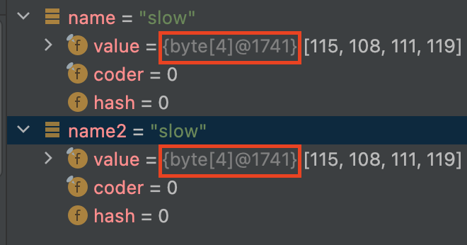

객채 생성이 빈번하고, 그 비용이 크다면? `불필요한 객체 생성을 피하면서 자원을 절약해라`

### 문자열 객체 생성
String을 new로 생성하면 항상 새로운 객체를 만들게 된다. 그렇기 때문에 같은 문자열을 새로 new로 생성하는 것은 비효율적이다. 따라서 아래와 같이 문자열을 생성해야한다.

```java
String name = "slow";
```

왜 이렇게 이런 방법으로 문자열을 생성하는 것이 좋을까?
문자열 리터털로 생성할 경우, `String Constant Pool` 영역에 할당된다. 그리고 상수풀에 생성된 문자열의 경우 하나만 존재하게 된다. 즉, 같은 문자열을 가지고 있는 변수를 생성하더라도 같은 문자열을 참조하게 된다.

```java
String name = "slow";
String name2 = "slow";

assertThat(name).isEqualTo(name2);
```




### 무거운 객체
만드는데 메모리나 시간이 오래 걸리는 객체 즉, `비싼` 객체를 반복해서 필요하다면 static final로 `캐싱`하여 재사용 하는 것이 좋다.

```java
public class Calculator {

	private static final String CUSTOM_REGEX_PATTERN = "//(.*)\n(.*)";
	private static final Pattern CUSTOM_PATTERN = Pattern.compile(CUSTOM_REGEX_PATTERN);
	private static final String DEFAULT_DELIMITER = ",|:";

	private String[] split(String userInputText) {
		Matcher customMatcher = CUSTOM_PATTERN.matcher(userInputText);
		if (customMatcher.find()) {
			return customSplit(customMatcher);
		}
		return userInputText.split(DEFAULT_DELIMITER);
	}
}
```

Pattern은 정규표현식에 해당하는 유한 상태 머신을 만들기 때문에 인스턴스 생성 비용이 높다. 즉 비싼 객체이다.
따라서 성능을 개선하려면 클래스 초기화 과정에서 캐싱해두고 재사용하는 것이 좋다.


### 오토박싱
불필요한 박싱/언박싱은 불필요한 메모리 할당, 재할당을 반복할 수 있다.

```java
long start = System.currentTimeMillis();
Long sum = 0l;
for (long i = 0; i <= Integer.MAX_VALUE; i++) {
    sum += i;
}
System.out.println(System.currentTimeMillis() - start);
```

sum 변수가 Long 타입이기 때문에 반복문을 돌면서 새로운 Long 객체를 2의 31제곱 만큼 만들게 되고 약 5초의 시간이 걸린다. 반면 기본 타입으로 수행한 결과는 0.6초로 1초도 걸리지 않는다.

따라서, 반드시 박싱이 필요한 경우가 아니라면 기본 타입을 사용해야 한다.